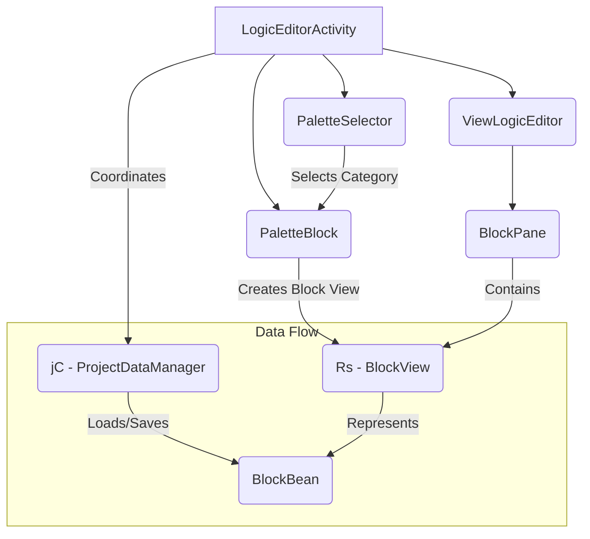
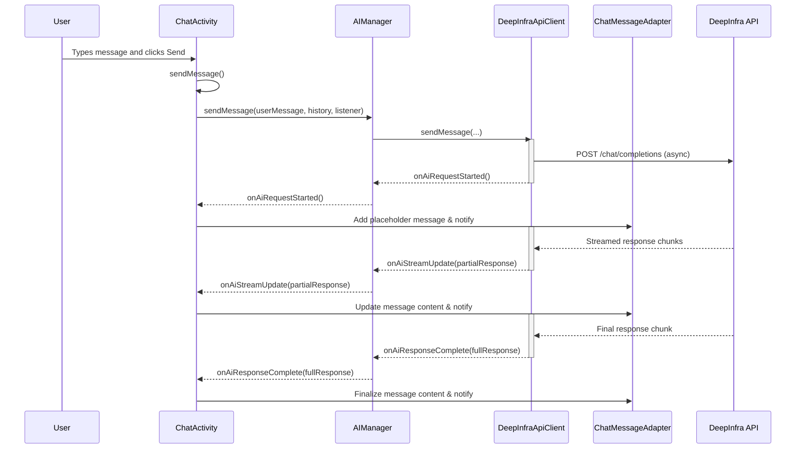

# Sketchware Pro - Deep Wiki

## 1. Introduction

*This section provides a high-level overview of the Sketchware Pro application, its purpose, and its intended audience.*

## 2. High-Level Architecture

*This section describes the main components of the application and how they interact. It includes a diagram to visualize the architecture.*

### 2.1. Architecture Diagram

```mermaid
graph TD
    subgraph User Interface
        direction LR
        A[Activities & Fragments]
        B[XML Layouts]
        C[View & Logic Editors]
    end

    subgraph Core Logic
        direction LR
        D[Project Management]
        E[Block Logic Processing]
        F[Java Code Generation]
        G[AI Assistant]
    end

    subgraph Build System
        direction LR
        H[Compiler Integrations]
        I[Android Toolchain (aapt2, d8)]
        J[Signing & Packaging]
    end

    subgraph Mods & Libraries
        direction LR
        K[Mod Packages (`mod.*`)]
        L[External Libraries (Glide, Gson)]
        M[Internal Libraries (`kellinwood`)]
    end

    A --> D;
    C --> E;
    E --> F;
    F --> H;
    H --> I;
    I --> J;
    J --> Z[Signed APK];
    G --> A;
    K --> D;
    K --> E;
    K --> F;
    L --> A;
    M --> J;
```

### 2.2. Component Descriptions

*   **User Interface (`pro.sketchware`, `com.besome.sketch`):** This layer is responsible for everything the user sees and interacts with. It is primarily built using Android's standard UI components.
    *   **Activities & Fragments:** These are the main screens of the application, such as `MainActivity`, `DesignActivity`, and `ChatActivity`. They are located in both the `pro.sketchware.activities` and `com.besome.sketch` packages.
    *   **XML Layouts:** Define the structure and appearance of the UI components.
    *   **View & Logic Editors:** These are complex, custom views that form the core of the IDE, allowing users to design their app's UI and logic. The main logic for these can be found in `com.besome.sketch.editor` and `com.besome.sketch.design`.

*   **Core Logic (`com.besome.sketch`, `pro.sketchware`):** This is the brain of the application.
    *   **Project Management:** Handles creating, opening, saving, and configuring Sketchware projects. Key classes are likely in `com.besome.sketch.projects`.
    *   **Block Logic Processing:** Translates the visual logic blocks into a format that can be converted to Java code.
    *   **Java Code Generation:** Takes the user's UI design and block logic and generates the corresponding Java source code for an Android project.
    *   **AI Assistant:** The new chat feature, which provides AI-powered assistance. Its code is located in `pro.sketchware.activities.chat` and `pro.sketchware.utility.ai`.

*   **Build System (`mod.*`, internal tools):** This layer is responsible for compiling the generated Java code into a working APK.
    *   **Compiler Integrations:** The app integrates compilers like `ecj` (Eclipse Compiler for Java) and `javac`.
    *   **Android Toolchain:** It uses tools like `aapt2` (for resource packaging) and `d8` (for DEXing). The logic for this is spread across various `mod` packages, indicating a highly customized build process.
    *   **Signing & Packaging:** Uses libraries like `kellinwood.security.zipsigner` to sign the generated APK.

*   **Mods & Libraries:**
    *   **Mod Packages:** The `mod.*` packages contain significant contributions from various developers, extending the original Sketchware functionality. These mods often contain their own build logic, custom components, and UI enhancements.
    *   **External Libraries:** The app uses popular libraries like `Glide` for image loading and `Gson` for JSON parsing.
    *   **Internal Libraries:** It includes libraries like `kellinwood` for handling ZIP files and APK signing.

## 3. Package Breakdown

*This section provides a detailed breakdown of the main Java packages in the application.*

### 3.1. `pro.sketchware`

**Purpose:** This is the primary package for the Sketchware Pro fork. It contains most of the new features, UI enhancements, and custom logic that differentiate it from the original Sketchware application.

**Key Sub-packages:**

*   **`activities`**: This package contains the `Activity` classes that form the backbone of the application's UI. Each major feature, like the `ChatActivity` or `ResourcesEditorActivity`, has its own dedicated activity here.
    *   `MainActivity`: The main entry point of the application.
    *   `ChatActivity`: The AI assistant chat interface.
    *   `ResourcesEditorActivity`: The editor for managing Android resources like strings, colors, and styles.

*   **`fragments`**: Holds the `Fragment` classes, which are reusable portions of the UI. This includes the main `ProjectsFragment` and various settings fragments.

*   **`adapters`**: Contains custom `RecyclerView.Adapter` implementations used to display lists of data, such as `ChatMessageAdapter` for the chat screen and `ConversationAdapter` for the list of conversations.

*   **`models`**: Defines the data structures (POJOs/data classes) used throughout the application. For example, `ChatMessage` and `Conversation` define the data model for the AI chat feature.

*   **`utility`**: A large and important package containing a wide range of helper and manager classes.
    *   `ai`: Contains all the logic for interacting with AI models, including the `AIManager` and `DeepInfraApiClient`.
    *   `apk`: Utilities for handling APK files, including signing.
    *   `chat`: Manages chat conversations and history.
    *   `theme`: Manages the application's theming.
    *   `FileUtil`, `XmlUtil`, `GsonUtils`: Core utilities for file, XML, and JSON operations.

*   **`lib`**: Contains custom libraries and base classes developed for Sketchware Pro.
    *   `validator`: A set of classes for validating user input, such as package names, colors, and font names.
    *   `highlighter`: Classes for syntax highlighting in the code editors.
    *   `iconcreator`: Custom views and logic for the icon creator feature.

*   **`blocks`**: Contains the logic for custom blocks added to the logic editor, extending the capabilities of the original Sketchware.

*   **`tools`**: A collection of factory and parser classes for creating and managing views and components programmatically.

### 3.2. `com.besome.sketch`

**Purpose:** This package contains the core logic of the original Sketchware application. It forms the foundation upon which Sketchware Pro is built. Understanding this package is essential to understanding the fundamental workings of the IDE.

**Key Sub-packages:**

*   **`beans`**: This is arguably one of the most important packages for understanding the project structure. It contains all the Plain Old Java Objects (POJOs) that define the data model of a Sketchware project.
    *   `ProjectBean`: Represents an entire Sketchware project, holding metadata and lists of other beans.
    *   `ViewBean`: Represents a widget (e.g., Button, TextView) in the UI designer.
    *   `BlockBean`: Represents a single block in the logic editor.
    *   `ComponentBean`: Represents a component (e.g., Intent, SharedPreferences).
    *   `EventBean`: Represents an event (e.g., `onClick`, `onCreate`).

*   **`editor`**: This package is the heart of the IDE, containing the logic for the visual editors.
    *   `LogicEditorActivity`: The main activity for the block-based logic editor.
    *   `manage`: A collection of activities for managing project assets, such as fonts, images, sounds, and libraries (`ManageLibraryActivity`).
    *   `view`: Contains the implementation of the UI designer, including the custom views for each widget (`ItemButton`, `ItemTextView`, etc.) and the main `ViewEditor` that handles dragging and dropping.

*   **`design`**: This package contains the `DesignActivity`, which acts as the main container for the `ViewEditor` and `LogicEditorActivity`, allowing the user to switch between designing the UI and writing the logic.

*   **`projects`**: Contains UI-related classes for managing projects, such as `MyProjectSettingActivity` for configuring project settings.

*   **`lib`**: Contains base classes (`BaseAppCompatActivity`) and custom UI components (`CollapsibleLayout`, `ColorPickerDialog`) that are used throughout the original application.

*   **`tools`**: Provides various tool activities that are part of the development process, such as `CompileLogActivity` for viewing compilation logs and `CollectErrorActivity` for reporting errors.

### 3.3. `mod.*`

**Purpose:** The `mod.*` packages are a collection of modules contributed by various developers in the Sketchware modding community. These packages are what make Sketchware Pro "Pro", adding a vast amount of functionality that was not present in the original application.

**Key Characteristics:**

*   **Modular Contributions:** Each sub-package, such as `mod.agus`, `mod.hey`, `mod.hilal`, `mod.jbk`, and `mod.pranav`, acts as a namespace for a specific developer or group's contributions.
*   **Advanced Features:** These packages often contain the logic for some of the most advanced features, such as:
    *   Custom build processes and compiler integrations.
    *   Support for native libraries (`.so` files).
    *   ProGuard and code shrinking configurations.
    *   Advanced permission management.
    *   Custom attribute injection into the AndroidManifest.
    *   Enhanced code editors and viewers.
*   **Decentralized Logic:** The logic for a single feature may be spread across multiple `mod` packages, which can make tracing the code challenging. A deep understanding of these packages is crucial for debugging build errors or modifying the compilation process.

## 4. Key Feature Implementations

*This section delves into the implementation details of key features.*

### 4.1. Project Compilation

The project compilation process is the most complex and critical part of the Sketchware Pro application. It involves a series of steps that transform a user's project (UI layouts, logic blocks, resources) into a runnable and signable Android APK.

#### 4.1.1. Entry Point

The compilation process is initiated when the user clicks the "Run" button in the `DesignActivity`. This triggers the execution of an inner class called `DesignActivity.BuildTask`.

#### 4.1.2. The `BuildTask` and `ProjectBuilder`

*   **`DesignActivity.BuildTask`**: This `AsyncTask`-like class manages the compilation process on a background thread. It updates the UI with progress information and handles the overall success or failure of the build.
*   **`a.a.a.ProjectBuilder`**: This is the core class that orchestrates the individual build steps. It calls various command-line tools and internal logic to perform the compilation. (Note: The `a.a.a` package suggests this might be an obfuscated or internal class).

#### 4.1.3. Compilation Pipeline

The following diagram illustrates the major stages of the compilation pipeline as executed by `BuildTask`.

```mermaid
graph TD
    A[Start Build] --> B{Setup & Prepare};
    B --> C{Compile Resources (aapt2)};
    C --> D{Generate ViewBinding};
    D --> E{Compile Kotlin};
    E --> F{Compile Java (ecj/javac)};
    F --> G{Obfuscate Strings (StringFog)};
    G --> H{Shrink & Obfuscate Code (R8/ProGuard)};
    H --> I{Create DEX files (d8)};
    I --> J{Merge DEX files};
    J --> K{Build Unsigned APK};
    K --> L{Sign APK};
    L --> M[Install APK];

    subgraph "Error Handling"
        Z{Indicate Error}
    end

    C -->|On Failure| Z;
    E -->|On Failure| Z;
    F -->|On-Failure| Z;
    I -->|On Failure| Z;
```

**Stage Descriptions:**

1.  **Setup & Preparation:** The build process starts by creating temporary directories and preparing the project's resources, including assets, drawables, and built-in libraries.
2.  **Compile Resources (aapt2):** Android's `aapt2` tool is executed to compile all XML resources (layouts, values, etc.) into a binary format and to generate the `R.java` class.
3.  **Generate ViewBinding:** If enabled, ViewBinding classes are generated for the XML layouts.
4.  **Compile Kotlin:** Any Kotlin code in the project is compiled into Java bytecode.
5.  **Compile Java (ecj/javac):** The generated Java source code, along with the user's custom Java files, is compiled into `.class` files using the Eclipse Compiler for Java (ECJ) or `javac`.
6.  **Obfuscate Strings (StringFog):** If enabled, the StringFog tool is used to encrypt string literals in the compiled `.class` files.
7.  **Shrink & Obfuscate Code (R8/ProGuard):** If enabled, R8 (or ProGuard) is used to shrink the codebase by removing unused code and to obfuscate the remaining code by renaming classes, methods, and fields.
8.  **Create DEX files (d8):** The `d8` tool converts the Java bytecode (`.class` files) into Dalvik Executable (`.dex`) files, which can be run on the Android Runtime (ART).
9.  **Merge DEX files:** If multiple DEX files are produced, they are merged.
10. **Build Unsigned APK:** The compiled resources, DEX files, assets, and native libraries are packaged into an unsigned APK file.
11. **Sign APK:** The unsigned APK is signed with a debug or release certificate using `apksigner`.
12. **Install APK:** The final, signed APK is installed on the device.

### 4.2. Logic Editor

The Logic Editor is where users build the logic of their applications using a block-based programming interface. It's one of the most complex custom UI components in the application.

#### 4.2.1. Architecture

The editor is composed of several key classes that work together to provide the drag-and-drop functionality and manage the block data.

*   **`LogicEditorActivity`**: The main `Activity` that hosts the entire editor. It acts as the central controller, handling user input, managing the lifecycle of the editor components, and coordinating data saving and loading.
*   **`ViewLogicEditor`**: The root custom `View` for the editor, containing the workspace.
*   **`BlockPane`**: The main workspace where blocks are placed and connected. It's a custom `ViewGroup` responsible for the layout and positioning of the block views.
*   **`PaletteSelector`**: The UI component on the left that displays the list of block categories (e.g., "Control", "Operator").
*   **`PaletteBlock`**: The panel that appears when a category is selected, displaying the available blocks for that category.
*   **`Rs` (likely `BlockView`)**: A custom `View` that represents a single block in the UI. It's responsible for drawing the block's shape, text, and parameters.
*   **`BlockBean`**: The data model for a single block. It stores all the information about a block, including its type, parameters, and its connections to other blocks. This is what gets saved to the project file.
*   **`jC` (likely `ProjectDataManager`)**: A data manager class responsible for reading and writing project data, including the list of `BlockBean`s for each event.

#### 4.2.2. Component Interaction Diagram

This diagram shows the relationship between the main components of the Logic Editor.



#### 4.2.3. User Interaction Flow

1.  **Loading:** When `LogicEditorActivity` starts, it calls `loadEventBlocks()`. This method retrieves the list of `BlockBean`s for the current event from the `jC` data manager.
2.  **Rendering:** For each `BlockBean`, a corresponding `Rs` (BlockView) is created and added to the `BlockPane`. The connections between blocks (`nextBlock`, `subStack1`, etc.) are also established.
3.  **Drag & Drop:**
    *   A long press on a block (handled by the `r()` runnable) initiates the drag operation.
    *   A `ViewDummy` is created to represent the block being dragged.
    *   The `onTouch` method tracks the user's finger movement and updates the position of the `ViewDummy`.
    *   It performs hit testing against the `BlockPane` (to find connection points) and the delete/copy icons in the top menu.
4.  **Saving:** When the user exits the editor or saves the project, the state of all the `Rs` (BlockView) instances in the `BlockPane` is converted back into a list of `BlockBean`s and saved using the `jC` data manager.

### 4.3. AI Assistant

The AI Assistant is a core feature of Sketchware Pro, providing users with a conversational interface to get help with coding and other tasks.

#### 4.3.1. Architecture

The feature is built upon several key components that handle the UI, state management, and communication with the AI model's API.

*   **`ChatActivity`**: The main UI controller for the chat screen. It's responsible for setting up the views, handling user input, and coordinating with the other components.
*   **`AIManager`**: A singleton manager class that acts as a bridge between the UI and the AI service. It handles loading AI models, managing settings, and initiating message requests.
*   **`DeepInfraApiClient`**: An implementation of the `ApiClient` interface. It's responsible for making network calls to the DeepInfra API, sending user messages, and handling the streaming response.
*   **`ChatMessageAdapter`**: A `RecyclerView.Adapter` that displays the chat messages in the UI. It uses the Markwon library to render Markdown in the messages.
*   **`ConversationManager`**: Handles the persistence of chat conversations, saving and loading them from storage.
*   **Data Models (`ChatMessage`, `Conversation`, `AIModel`)**: POJO classes that define the structure of the data used in the chat feature.

#### 4.3.2. Message Flow (Sequence Diagram)

This diagram illustrates the sequence of events when a user sends a message.



## 5. Agent Developer Guide

*This section provides tips and guidance for AI agents (and human developers) working on this codebase.*

### 5.1. Getting Started: Where to Look

*   **For UI changes to existing Pro features (like the AI Chat):** Start in `pro.sketchware.activities` and the corresponding XML layout files in `app/src/main/res/layout`.
*   **For core IDE logic (like the UI designer or block editor):** Look in the `com.besome.sketch.editor` and `com.besome.sketch.design` packages. The data models for projects are in `com.besome.sketch.beans`.
*   **For build and compilation issues:** This is the most complex area. The logic is spread across the `mod.*` packages. `mod.agus.jcoderz` and `mod.hey.studios` seem to contain significant build-related code. Start by searching for the specific error message or tool name (e.g., `aapt2`, `d8`) within these packages.
*   **To add a new feature:** The `pro.sketchware` package is the best place for new, high-level features. Follow the existing structure by creating new activities, adapters, and utility classes as needed.

### 5.2. Code Conventions & Patterns

*   **ViewBinding:** The newer code (especially in `pro.sketchware`) uses ViewBinding (e.g., `ActivityChatBinding`). This is the preferred way to interact with views. Avoid using `findViewById`.
*   **Singleton Managers:** The app uses singleton manager classes to handle global state and services (e.g., `AIManager`, `ConversationManager`). This is a common pattern to be aware of.
*   **Utility Classes:** There are many utility classes (e.g., `FileUtil`, `XmlUtil`). Before writing new helper functions, check if a suitable one already exists in `pro.sketchware.utility` or `com.besome.sketch.lib`.
*   **Iterative Approach:** For large tasks like documentation, communicate your plan to the user and work iteratively. Submit your progress frequently for feedback.

### 5.3. Common Pitfalls & Warnings

*   **Decentralized `mod` Logic:** The logic for a single, complex feature (like the build process) can be spread across multiple `mod.*` packages. This makes debugging difficult. Be prepared to trace code across different developers' modules.
*   **Legacy Code (`com.besome.sketch`):** The original codebase may not always follow modern Android best practices. Be careful when modifying these files, as they can have unexpected side effects.
*   **Environment-Dependent Build:** The project may not build in all environments due to missing local properties (like `sdk.dir`). Do not get stuck on build failures if the user has indicated that they are environment-related. Focus on the code changes.
*   **`grep` is your best friend:** The codebase is large and not always intuitively organized. Use `grep` extensively to find where classes, methods, and resources are used.
